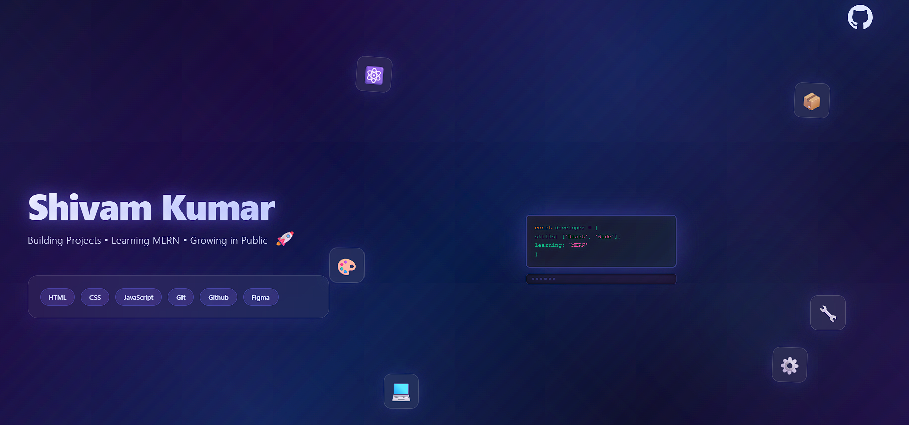

  

# Hi 👋, I'm Shivam Kumar

🚀 Frontend Developer | Learning MERN Stack | Building Projects in Public

---

## 💻 About Me

- 🌱 Currently learning MERN Stack
- 🚀 Building real-world web development projects
- 📚 Sharing my coding journey publicly
- 🎯 Goal: Become a Full-Stack Developer
- ⚡ Learning by building projects and solving real-world problems

---

## 🛠️ Tech Stack

### Frontend
- HTML5
- CSS3
- JavaScript

### Tools & Platforms
- Git
- GitHub
- VS Code
- Netlify
- Figma

---

## 🚀 Featured Projects

### 🌐 Portfolio Website
Personal portfolio showcasing my frontend development journey, skills, and projects.

### 👕 Laundry-Wallaah
Responsive laundry service website with a modern user interface.

### 🍝 Bella Vista Restaurant
Restaurant landing page with responsive design and attractive layout.

### 🛒 Flipkart Clone UI
Frontend clone inspired by Flipkart's user interface.

### 🛍️ Amazon Clone UI
Frontend clone inspired by Amazon's shopping experience.

---

## 🎯 Current Focus

- Advanced JavaScript
- React.js
- MERN Stack Development
- Building Real-World Projects

---

## 🌐 Portfolio

🔗 https://myportfolio-shivamm.netlify.app/

---

## 📫 Connect With Me

- GitHub: https://github.com/shivamsahil030
- LinkedIn: https://www.linkedin.com/in/shivam-kumar-9a0967380
- X (Twitter): https://x.com/shivamkumar509

---

## ⚡ Fun Fact

Every project on my GitHub profile represents a step in my learning journey.

> Consistency beats perfection. 🚀
